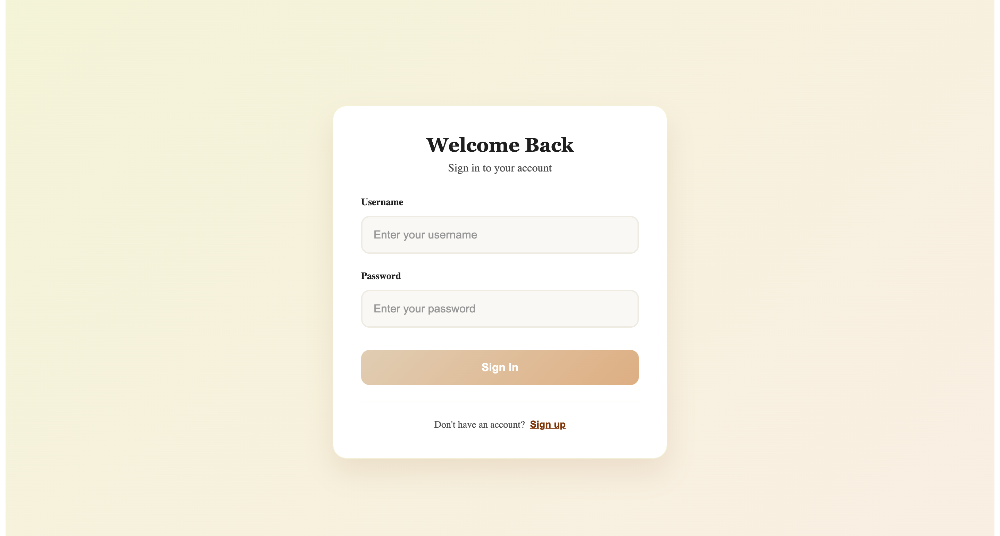

# Role-Based Management System

A full-stack Role-Based Access Control (RBAC) application built with Flask, Vue.js, JWT authentication, and SQLite.

The system allows administrators to manage users, moderate content, and monitor system activity while enforcing secure role-based permissions.

---

## Features

### Authentication

- User Registration
- User Login
- JWT Authentication
- Protected Routes

### User Management

- Create Users
- View Users
- Delete Users
- Assign Roles

### Post Management

- Create Posts
- View Posts
- Moderate Posts

### Administration

- Manage Users
- Moderate Content
- View Audit Logs
- Role-Based Access Control

### Security

- Password Hashing
- JWT Tokens
- Backend Authorization Checks
- Frontend Route Protection

---

## Tech Stack

### Backend

- Flask
- Flask-SQLAlchemy
- Flask-Migrate
- Flask-JWT-Extended
- SQLite

### Frontend

- Vue.js
- Vue Router
- Axios
- Vite

---

# Application Screenshots

## User Registration


---

## User Login



---

## Create New Post


---

## Admin - Create New User


---

## Admin - Manage Users


---

## Admin - Moderate Posts


---

## Admin - System Logs


---

# RBAC Architecture

The application follows the standard RBAC model:

```text
Users
   ↓
Roles
   ↓
Permissions
```

### Roles

| Role | Permissions |
|--------|-------------|
| USER | Create and view posts |
| ADMIN | Full access to users, posts, and logs |

---

# Project Structure

```text
role-based-management-system
│
├── backend
│   ├── app.py
│   ├── app
│   │   ├── models
│   │   ├── routes
│   │   ├── utils
│   │   └── extensions.py
│   │
│   ├── migrations
│   └── instance
│
├── frontend
│   └── role-based-management-system
│       └── frontend
│
├── screenshots
│
└── README.md
```

---

# Getting Started

## 1. Clone Repository

```bash
git clone https://github.com/niyibizimadeit/role-based-management-system.git
cd role-based-management-system
```

---

# Backend Setup

Navigate to the backend directory:

```bash
cd backend
```

Create a virtual environment:

### macOS / Linux

```bash
python3 -m venv venv
source venv/bin/activate
```

### Windows

```bash
python -m venv venv
venv\Scripts\activate
```

Install dependencies:

```bash
pip install -r requirements.txt
```

Apply migrations:

```bash
flask db upgrade
```

Run the backend:

```bash
python app.py
```

The backend will be available at:

```text
http://127.0.0.1:5000
```

---

# Frontend Setup

Open a new terminal and navigate to the frontend:

```bash
cd frontend/role-based-management-system/frontend
```

Install dependencies:

```bash
npm install
```

Start the development server:

```bash
npm run dev
```

The frontend will be available at:

```text
http://localhost:5173
```

---

# Running the Application

Start the backend:

```bash
cd backend
python app.py
```

Start the frontend:

```bash
cd frontend/role-based-management-system/frontend
npm run dev
```

Open:

```text
http://localhost:5173
```

---

# API Endpoints

## Authentication

| Method | Endpoint |
|----------|----------|
| POST | /api/auth/register |
| POST | /api/auth/login |

---

## Posts

| Method | Endpoint |
|----------|----------|
| GET | /api/posts |
| POST | /api/posts |

---

## Admin

| Method | Endpoint |
|----------|----------|
| GET | /api/admin/users |
| POST | /api/admin/users |
| DELETE | /api/admin/users/<id> |
| GET | /api/admin/posts |
| GET | /api/admin/logs |

---

# Example Workflow

### Standard User

1. Register Account
2. Login
3. Create Posts
4. View Posts

### Administrator

1. Login
2. Create Users
3. Manage Users
4. Moderate Posts
5. View System Logs

---

# Future Improvements

- Refresh Tokens
- Password Reset
- Email Verification
- Granular Permissions
- PostgreSQL Support
- Docker Deployment
- CI/CD Pipeline

---

# Author

**NIYIBIZI Prince**

Computer Science Student | Taizhou University

GitHub:
https://github.com/niyibizimadeit